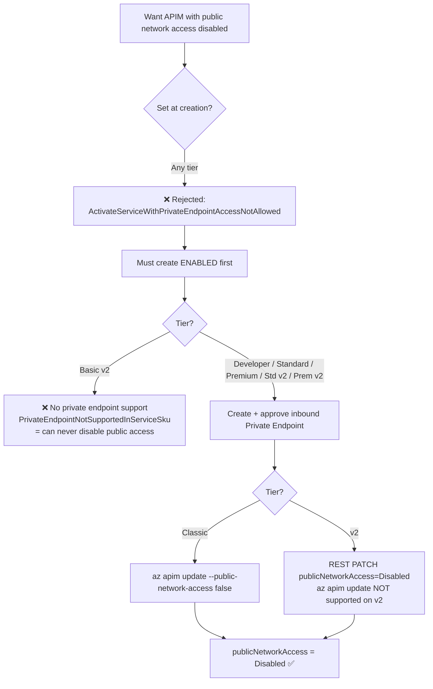
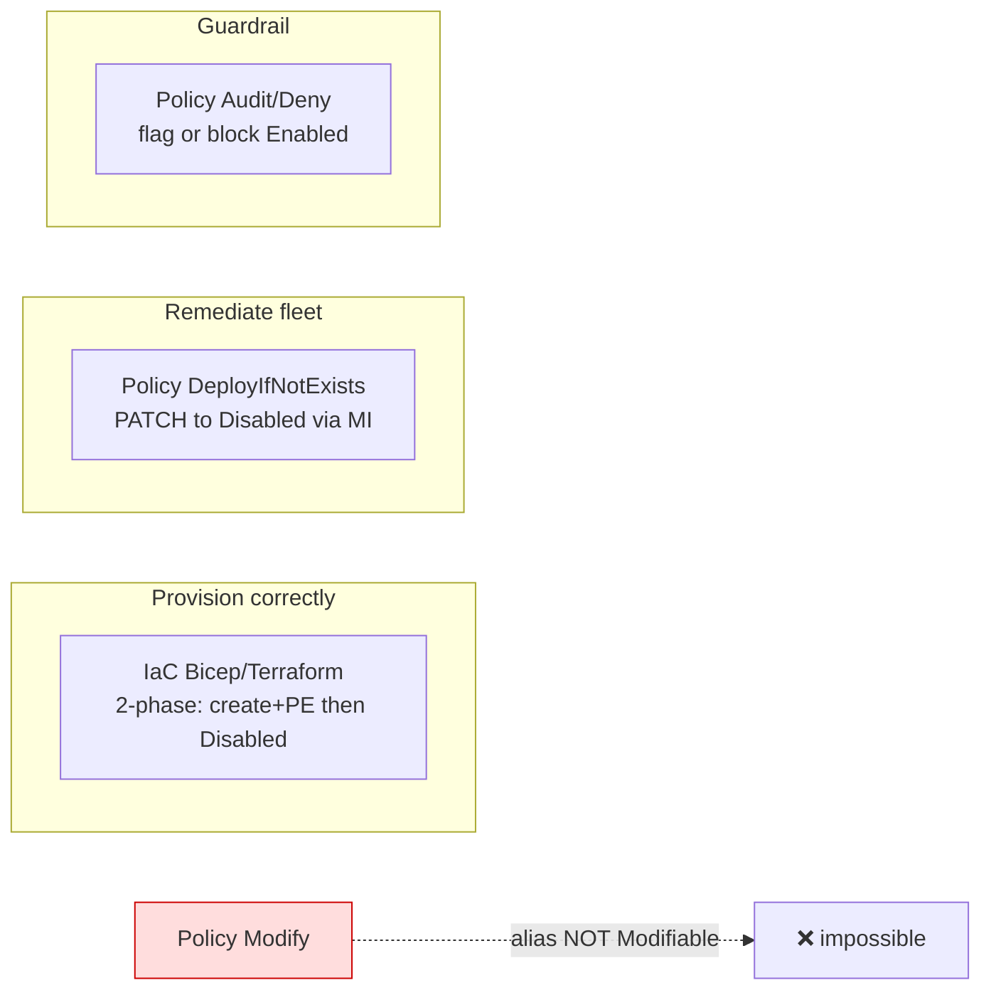

# APIM `publicNetworkAccess` — can you disable it at creation, and how to do it at scale?

> **Lab date:** 2026-07-01 · **Region:** `swedencentral` · **Subscription:** Litware MCAPS (`a8fbd8e1-…`)
> Reproducible lab that answers a real customer question about disabling public network access on Azure API Management (APIM), across **classic** and **v2** tiers.

## The question

> A customer wants to create APIM gateways with **public network access disabled at creation time**. That isn't possible, so they tried to disable it **post-deployment with Azure Policy** to do it at scale — but the `publicNetworkAccess` alias **isn't modifiable via policy**. Is `az apim update` the recommended way to set this post-creation, and **how do other customers do this at scale** without a manual API/CLI call?

## TL;DR answer

1. **You cannot disable public network access at creation — on any tier.** The control plane rejects it synchronously. It can only be disabled on an **existing** instance that **already has an approved private endpoint**.
2. **A Policy `modify` effect is impossible here** — the APIM `publicNetworkAccess` alias is **not flagged `Modifiable`** (verified live; contrast with Storage, which is). This is *by design*, not a bug.
3. **`az apim update --public-network-access false` is the sanctioned method — but only for classic tiers.** v2 tiers reject the CLI and require the **REST API / portal**.
4. **At scale, wrap the post-create disable in either:**
   - **IaC (Bicep/Terraform/ARM)** — a two-phase declarative deployment (create + PE, then flip to Disabled), driven by a pipeline. *Primary recommendation.*
   - **Azure Policy `DeployIfNotExists` (DINE)** — the policy-native way to enforce/remediate fleet-wide, since `modify` can't be used. Pair with an `audit`/`deny` guardrail.
5. **Basic v2 can *never* disable public network access** — it supports neither inbound private endpoints nor the disable operation.

---

## Findings per tier

| Tier | Create with `Disabled`? | Private endpoint? | Disable via `az apim update`? | Disable via REST PATCH? | Net result |
|---|---|---|---|---|---|
| **Developer (classic)** | ❌ rejected | ✅ supported | ✅ works | ✅ works | Disable **after** PE, CLI or REST |
| **Basic v2** | ❌ rejected | ❌ **not supported** | ❌ (n/a) | ❌ requires PE | **Cannot disable public access at all** |
| **Standard v2** | ❌ rejected | ✅ supported | ❌ **CLI too-old API version** | ✅ works | Disable **after** PE, **REST only** |
| **Premium v2** | ❌ rejected (per docs) | ✅ supported | ❌ (REST/portal) | ✅ works | Same as Standard v2 |

Two independent divergences between classic and v2:
- **PE support**: classic ✅, Basic v2 ❌, Standard/Premium v2 ✅.
- **Tooling**: classic uses `az apim update`; v2 SKUs reject it (`OperationSupportedInSkuForApiVersions`) and must use REST/portal.

---

## Decision flow



## At-scale enforcement options



| Approach | Sets at create? | Fixes existing fleet? | Manual CLI? | Notes / trade-off |
|---|---|---|---|---|
| **IaC (Bicep/TF/ARM)** | No (2-phase) | Only what you redeploy | No (pipeline) | Deterministic, ordered; teams must provision through your modules |
| **Policy `modify`** | — | — | — | **Impossible** — alias not `Modifiable` |
| **Policy `DeployIfNotExists`** | No (async after create) | ✅ Yes | No | Needs managed identity + a PE-first template; remediation is asynchronous |
| **Policy `audit`/`deny`** | Blocks/flags only | Detects, can't fix | No | Great guardrail, cannot remediate; pair with DINE/IaC |
| **`az apim update` / REST** | No | Per-instance | Yes | The underlying op the others wrap; classic=CLI, v2=REST |

---

## Scenarios & evidence

### S0 — The policy alias is not `Modifiable` (the crux, no deployment needed)

```bash
# APIM alias
az provider show --namespace Microsoft.ApiManagement --expand "resourceTypes/aliases" \
  --query "resourceTypes[?resourceType=='service'].aliases[] | [?name=='Microsoft.ApiManagement/service/publicNetworkAccess']"
```
```jsonc
[ { "defaultMetadata": null,               // <-- no "attributes": "Modifiable"
    "defaultPath": "properties.publicNetworkAccess",
    "name": "Microsoft.ApiManagement/service/publicNetworkAccess" } ]
```
Contrast — **Storage**, which *is* modifiable:
```jsonc
[ { "defaultMetadata": { "attributes": "Modifiable", "type": "String" },   // <-- modifiable
    "name": "Microsoft.Storage/storageAccounts/publicNetworkAccess" } ]
```
➡️ A Policy `modify`/`append` effect can set Storage's property but **cannot** set APIM's. Raw output: [`raw-output/alias-apim-publicnetworkaccess.json`](raw-output/alias-apim-publicnetworkaccess.json).

### S1 — Create-time disable is rejected (both tiers)

```bash
az rest --method PUT --uri ".../service/<name>?api-version=2024-05-01" \
  --body '{ "location":"swedencentral", "sku":{"name":"Developer","capacity":1},
            "properties":{ "publisherEmail":"…", "publisherName":"…",
                           "publicNetworkAccess":"Disabled" } }'
```
```
ERROR: ActivateServiceWithPrivateEndpointAccessNotAllowed
"Blocking all public network access by setting property publicNetworkAccess ...
 is not enabled during service creation."
```
Identical result for `Developer` and `Basicv2`. The resource is **not created**. Raw: [`raw-output/s1-createtime-rejection.txt`](raw-output/s1-createtime-rejection.txt).

### S2a — Classic: disable after private endpoint (CLI path)

```bash
# 1. private endpoint to the Gateway subresource
az network private-endpoint create -g rg-apim-pna-lab -n pe-apim-classic \
  --vnet-name vnet-apim-lab --subnet snet-pe \
  --private-connection-resource-id <classic-id> --group-id Gateway \
  --connection-name pe-classic-conn
# 2. disable public network access (classic-only CLI)
az apim update -g rg-apim-pna-lab -n apim-classic-ven9pg --public-network-access false
```
Result: `publicNetworkAccess = Disabled`. Raw: [`raw-output/s2a-classic-disable.txt`](raw-output/s2a-classic-disable.txt).

### S2c — Standard v2: `az apim update` fails, REST works

```bash
az apim update -g rg-apim-pna-lab -n apim-stdv2-ven9pg --public-network-access false
# ERROR: OperationSupportedInSkuForApiVersions
#   Operation on StandardV2 SKU is only supported in the api-versions 2023-03-01-preview,…,2024-05-01,…

az rest --method PATCH --uri ".../apim-stdv2-ven9pg?api-version=2024-05-01" \
  --body '{ "properties": { "publicNetworkAccess": "Disabled" } }'
# -> accepted, publicNetworkAccess = Disabled after async update
```
Raw: [`raw-output/s2c-stdv2-disable.txt`](raw-output/s2c-stdv2-disable.txt).

### S-divergence — Basic v2 cannot disable at all

```
az network private-endpoint create … (Basic v2)
  -> ERROR PrivateEndpointNotSupportedInServiceSku
az rest PATCH publicNetworkAccess=Disabled (Basic v2, no PE)
  -> ERROR DisablingPublicNetworkAccessRequiredPrivateEndpoint
```
Raw: [`raw-output/divergence-basicv2-cannot-disable.txt`](raw-output/divergence-basicv2-cannot-disable.txt).

### S4 — DeployIfNotExists policy remediation (at scale) ✅ validated end-to-end

Definition [`policy/dine-apim-disable-pna.json`](policy/dine-apim-disable-pna.json), guardrail [`policy/audit-deny-apim-public-access.json`](policy/audit-deny-apim-public-access.json).

```bash
az policy definition create --name apim-disable-pna-dine --mode Indexed --rules @rules.json --params @params.json
az policy assignment create --name apim-disable-pna-assign --policy apim-disable-pna-dine \
  --scope <rg> --mi-system-assigned --location swedencentral            # -> principalId
az role assignment create --assignee-object-id <principalId> --assignee-principal-type ServicePrincipal \
  --role 312a565d-c81f-4fd8-895a-4e21e48d571c --scope <rg>              # API Management Service Contributor
az policy remediation create --name r3 --policy-assignment apim-disable-pna-assign \
  --resource-group <rg> --resource-discovery-mode ExistingNonCompliant
```

**Result — task Succeeded, 3 deployments (1 success / 2 fail):**

| Target | Outcome | Reason |
|---|---|---|
| `apim-stdv2` | ✅ **SUCCEEDED** — flipped Enabled → **Disabled** | Has approved PE; MI PATCHed it. **No manual CLI/API call.** |
| `apim-basicv2` | ❌ FAILED | `DisablingPublicNetworkAccessRequiredPrivateEndpoint` — Basic v2 has no PE (expected caveat) |
| `apim-classic` | ❌ FAILED | `NoPolicyEvaluationResult` — stale record; classic was already Disabled from S2a |

Evidence: [`raw-output/s4-dine-remediation.txt`](raw-output/s4-dine-remediation.txt).

> 🔧 **DINE template gotcha (fixed in this repo):** the first template used `reference()` inside the resource's `sku` block to preserve the existing SKU/publisher — ARM rejects that (`"The template function 'reference' is not expected at this location"`). `reference()` is not allowed in a resource's `sku`/`name`/`location`. The fix is to pass `sku.name`, `sku.capacity`, `publisherEmail`, `publisherName` as **deployment parameters** resolved by the policy engine via `field()` aliases, then use `parameters()` in the template.

> ⚠️ DINE remediation only succeeds on instances that **already have an approved private endpoint**; otherwise the PATCH hits `DisablingPublicNetworkAccessRequiredPrivateEndpoint`. A production DINE template should therefore also deploy the private endpoint (and thus cannot target Basic v2).

---

## IaC reference

[`bicep/apim-private.bicep`](bicep/apim-private.bicep) — parameterised two-phase template. Phase 1 (`disablePublicNetworkAccess=false`) creates APIM + private endpoint; phase 2 (`=true`) flips it to `Disabled`. Terraform equivalent: `azurerm_api_management.public_network_access_enabled = false` + `azurerm_private_endpoint`.

## Reproduce

```bash
az group create -n rg-apim-pna-lab -l swedencentral
az network vnet create -g rg-apim-pna-lab -n vnet-apim-lab \
  --address-prefixes 10.10.0.0/16 --subnet-name snet-pe --subnet-prefixes 10.10.1.0/24
# then follow S1 / S2 / S4 above
```

## Cleanup

```bash
az group delete -n rg-apim-pna-lab --yes --no-wait
# plus remove any subscription/MG-scoped policy assignment + definition created for S4
```

---
*Generated by the Copilot azure-lab skill. Outputs sanitized of secrets.*
