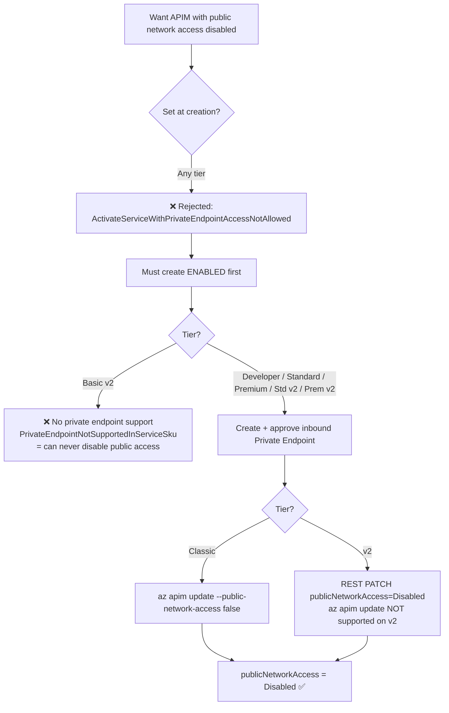
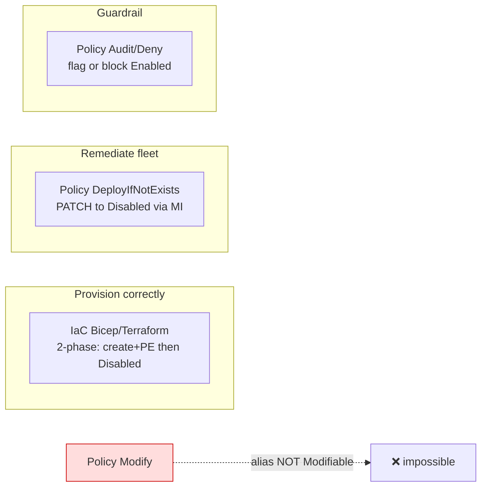

# APIM `publicNetworkAccess` — can you disable it at creation, and how to do it at scale?

> **Lab date:** 2026-07-01 · **Region:** `swedencentral` · **Subscription:** Litware MCAPS (`a8fbd8e1-…`)
> Reproducible lab that answers a real customer question about disabling public network access on Azure API Management (APIM), across **classic** and **v2** tiers.

## The question

> A customer wants to create APIM gateways with **public network access disabled at creation time**. That isn't possible, so they tried to disable it **post-deployment with Azure Policy** to do it at scale — but the `publicNetworkAccess` alias **isn't modifiable via policy**. Is `az apim update` the recommended way to set this post-creation, and **how do other customers do this at scale** without a manual API/CLI call?

## TL;DR answer

1. **You cannot disable public network access at creation — on any tier.** The control plane rejects it synchronously. It can only be disabled on an **existing** instance that **already has an approved private endpoint**.
2. **A Policy `modify` effect is impossible here** — the APIM `publicNetworkAccess` alias is **not flagged `Modifiable`** (verified live; contrast with Storage, which is). This is *by design*, not a bug.
3. **`az apim update --public-network-access false` is the sanctioned method — but only for classic tiers.** v2 tiers reject the CLI and require the **REST API / portal**.
4. **At scale, wrap the post-create disable in either:**
   - **IaC (Bicep/Terraform/ARM)** — a two-phase declarative deployment (create + PE, then flip to Disabled), driven by a pipeline. *Primary recommendation.*
   - **Azure Policy `DeployIfNotExists` (DINE)** — the policy-native way to enforce/remediate fleet-wide, since `modify` can't be used. Pair with an `audit`/`deny` guardrail.
   - *(niche)* **A script embedded in the IaC deployment** (`Microsoft.Resources/deploymentScripts`) can PATCH the flag in a single deployment — but it needs a key-enabled storage account and is **blocked** in tenants that disable shared-key storage (see [validation](#val--validating-the-other-at-scale-approaches)).
5. **Basic v2 can *never* disable public network access** — it supports neither inbound private endpoints nor the disable operation.

> All five approaches were **empirically validated** in a live lab — see [Validating the other at-scale approaches](#val--validating-the-other-at-scale-approaches).

---

## New to APIM or Azure Policy? Start here

This section explains the moving parts from scratch. If you already know APIM and DINE policies, skip to [Findings per tier](#findings-per-tier).

### What is API Management (APIM)?

Azure **API Management** is a managed **API gateway** — a front door that sits between API consumers and your backend services. Clients call APIM; APIM applies auth, rate-limiting, caching, and routing, then forwards the call to the real backend. By default an APIM instance has a **public endpoint** on the internet.

APIM comes in **tiers (SKUs)** with different capabilities and prices. There are two generations:
- **Classic** tiers: `Developer` (cheap, no SLA — for labs), `Basic`, `Standard`, `Premium`.
- **v2** tiers (newer architecture, faster to deploy): `Basic v2`, `Standard v2`, `Premium v2`.

The tier matters a lot here because networking features differ between them — which is the source of the divergences this lab documents.

### What is "public network access" and a private endpoint?

- **`publicNetworkAccess`** is a property on the APIM instance. When `Enabled` (default), the gateway is reachable from the public internet. When `Disabled`, only **private** traffic is allowed.
- A **private endpoint (PE)** is a network interface with a *private* IP address, placed inside your virtual network (VNet). It gives resources on that VNet a private, non-internet path to the APIM instance over Azure's backbone (Azure Private Link).
- The rule Azure enforces: you may only set `publicNetworkAccess = Disabled` **after** an approved private endpoint exists — otherwise you'd instantly lock yourself out (no public path *and* no private path). That ordering constraint is the root cause of nearly everything in this lab.

### What is Azure Policy?

**Azure Policy** is a governance service that evaluates your resources against rules ("policy definitions") and can **audit**, **block**, or **auto-fix** them at scale (across a whole subscription or management group). A rule has two halves:
- an **`if`** condition that decides which resources the rule applies to, and
- a **`then`** **effect** that says what to do.

Common effects and *when* they act:

| Effect | When it runs | What it does |
|---|---|---|
| `audit` | at create/update **and** on periodic scans | Only *flags* non-compliant resources (reporting). Changes nothing. |
| `deny` | **during** a create/update request | *Blocks* the request before it is saved. |
| `modify` | **during** a create/update request | **Rewrites** the incoming request payload (e.g. force a property to a value) before it is saved. |
| `deployIfNotExists` (**DINE**) | **after** a resource is created/updated, and on scans | Runs a **separate follow-up deployment** to bring the resource into compliance. |

### What is a policy "alias", and why does "Modifiable" matter?

Azure Policy can't see arbitrary JSON paths inside a resource — it can only reference properties that the resource provider has published as **aliases** (e.g. `Microsoft.ApiManagement/service/publicNetworkAccess`). Each alias carries metadata, including an **`attributes`** flag that is either `Modifiable` or absent.

- If an alias is **`Modifiable`**, the `modify` and `append` effects are allowed to change it *in the incoming request*.
- If it is **not** `Modifiable` (APIM's `publicNetworkAccess` is not), Azure Policy **refuses to even save** a `modify` definition that targets it. We proved this live — see [S0](#s0--the-policy-alias-is-not-modifiable-the-crux-no-deployment-needed) and [val-modify](#val--validating-the-other-at-scale-approaches).

### The key idea: *why does DINE work when `modify` cannot?*

This is the crux of the whole question, so it's worth being precise:

- **`modify` edits the request in flight.** When you create or update the resource, the policy engine mutates the JSON payload *before* Resource Manager persists it. Azure only permits this for properties on the **`Modifiable` allow-list** (a safety catalog the resource provider controls). `publicNetworkAccess` isn't on that list, so `modify` is rejected outright — you can't even create the definition.

- **DINE makes a normal follow-up API call.** DINE does **not** touch the original request. It watches for resources that fail an **existence condition** (here: "`publicNetworkAccess` is not `Disabled`"), and when it finds one it uses a **managed identity** to launch an *ordinary ARM deployment* — exactly the same public REST call a human or a CI/CD pipeline would make. Because it's a regular deployment and **not** an in-request mutation, it is **not** constrained by the `Modifiable` allow-list. It can set anything the REST API itself accepts.

> **Analogy.** `modify` is like a mail-room clerk who is only allowed to edit certain fields on a letter as it passes through — `publicNetworkAccess` isn't a field they're cleared to touch, so they refuse the job entirely. DINE is like a colleague who lets the letter go through unchanged, then later walks over and files a brand-new, fully-authorized form to correct it. The second person isn't bound by the clerk's narrow edit list.

**The catch:** because DINE just calls the normal API, it is *also* subject to the platform's own rules. Setting `publicNetworkAccess = Disabled` still requires an approved private endpoint — so DINE succeeds on instances that have a PE and **fails** on ones that can't (e.g. Basic v2). A production-grade DINE policy therefore also deploys the private endpoint as part of its remediation template.

### Pieces a DINE policy needs (glossary)

- **Policy definition** — the rule itself (the `if`/`then` with the remediation ARM template).
- **Policy assignment** — attaches the definition to a scope (subscription / resource group). For DINE it must be given a **managed identity**.
- **Managed identity + role** — the identity DINE uses to make changes; it needs an RBAC role with permission to edit the resource (here, *API Management Service Contributor*).
- **Existence condition** — the test for "already compliant" so DINE only acts on resources that need fixing.
- **Remediation task** — DINE fixes *new/updated* resources automatically; to fix **existing** resources you trigger a one-off *remediation task* that scans and deploys to the non-compliant ones.

### What is "IaC" and a "two-phase" deployment?

**Infrastructure as Code (IaC)** means describing your Azure resources in a text file (Bicep, ARM JSON, or Terraform) and letting a tool create them, instead of clicking in the portal or typing CLI commands by hand. The file is version-controlled and run by a **pipeline** (an automated CI/CD job), so the same result is reproducible across dozens of subscriptions — that's what "at scale" means here.

Because Azure won't accept `publicNetworkAccess = Disabled` until a private endpoint exists, a single IaC file is applied **twice**:
- **Phase 1** — create the APIM instance *and* its private endpoint, still `Enabled`.
- **Phase 2** — re-run the *same* file with one parameter flipped, which sets `Disabled`.

Re-running the same declarative file is safe: IaC is **idempotent** (applying it again only changes what's different), so phase 2 just performs the one remaining change.

### What is a "script in IaC" (`deploymentScripts`), and shared-key storage?

Sometimes people want to avoid the two-phase split and do everything in **one** deployment. ARM/Bicep offers a special resource, **`Microsoft.Resources/deploymentScripts`**, that runs a small **Azure CLI or PowerShell script as part of the deployment itself**. You can tell it to wait for the private endpoint (`dependsOn`) and then run the command that disables public access — all in a single apply.

The hidden cost: to run that script, Azure automatically creates a temporary **Azure Container Instance (ACI)** — a throwaway container — plus a **Storage account** to hold the script and its output. That storage account is accessed using its **access key** ("shared-key" authentication — a long secret string, as opposed to identity-based sign-in).

Many security-conscious organizations enforce a policy that **forbids shared-key access on storage accounts** (identity-only). In such tenants, `deploymentScripts` simply cannot run — it fails with `KeyBasedAuthenticationNotPermitted`. Ironically those are the same organizations most likely to want public access disabled, so this option is usually unavailable exactly where you'd reach for it. (Terraform doesn't have this problem because its script step runs on the pipeline machine, not in an Azure-side storage-backed container.)

---

## Findings per tier

| Tier | Create with `Disabled`? | Private endpoint? | Disable via `az apim update`? | Disable via REST PATCH? | Net result |
|---|---|---|---|---|---|
| **Developer (classic)** | ❌ rejected | ✅ supported | ✅ works | ✅ works | Disable **after** PE, CLI or REST |
| **Basic v2** | ❌ rejected | ❌ **not supported** | ❌ (n/a) | ❌ requires PE | **Cannot disable public access at all** |
| **Standard v2** | ❌ rejected | ✅ supported | ❌ **CLI too-old API version** | ✅ works | Disable **after** PE, **REST only** |
| **Premium v2** | ❌ rejected (per docs) | ✅ supported | ❌ (REST/portal) | ✅ works | Same as Standard v2 |

Two independent divergences between classic and v2:
- **PE support**: classic ✅, Basic v2 ❌, Standard/Premium v2 ✅.
- **Tooling**: classic uses `az apim update`; v2 SKUs reject it (`OperationSupportedInSkuForApiVersions`) and must use REST/portal.

---

## Decision flow



## At-scale enforcement options



| Approach | Sets at create? | Fixes existing fleet? | Manual CLI? | Notes / trade-off |
|---|---|---|---|---|
| **IaC (Bicep/TF/ARM)** | No (2-phase) | Only what you redeploy | No (pipeline) | Deterministic, ordered; teams must provision through your modules |
| **Policy `modify`** | — | — | — | **Impossible** — alias not `Modifiable` |
| **Policy `DeployIfNotExists`** | No (async after create) | ✅ Yes | No | Needs managed identity + a PE-first template; remediation is asynchronous |
| **Policy `audit`/`deny`** | Blocks/flags only | Detects, can't fix | No | Great guardrail, cannot remediate; pair with DINE/IaC |
| **Script in IaC (`deploymentScripts`)** | ✅ single deployment (dependsOn PE) | Only what you redeploy | No (runs in-template) | **Blocked** where shared-key storage is denied; extra ACI+storage cost; imperative-in-declarative |
| **`az apim update` / REST** | No | Per-instance | Yes | The underlying op the others wrap; classic=CLI, v2=REST |

---

## <a id="val--validating-the-other-at-scale-approaches"></a>Val — Validating the other at-scale approaches

DINE (S4) was validated end-to-end above. Because it *failed by design* on Basic v2 (no PE) and looked inconclusive on classic (stale compliance record), every **other** at-scale option was also exercised live on a Standard v2 instance (`rg-apim-pna-lab2`). Results:

| # | Approach | Result | Evidence |
|---|---|---|---|
| 1 | **IaC 2-phase (Bicep)** — *primary rec* | ✅ **Works.** Phase 1 creates APIM + PE (`Enabled`); phase 2 = same template flips to `Disabled`. Declarative, idempotent, pipeline-friendly. | [`val-iac-and-deny.txt`](raw-output/val-iac-and-deny.txt), [`bicep/apim-private.bicep`](bicep/apim-private.bicep) |
| 2 | **Policy `modify`** | ❌ **Impossible.** Azure *rejects the definition at creation*: `InvalidPolicyRuleModifyDetails … aliases that are not modifiable`. You cannot even save it. | [`val-modify-rejected.txt`](raw-output/val-modify-rejected.txt), [`policy/modify-apim-disable-pna-REJECTED.json`](policy/modify-apim-disable-pna-REJECTED.json) |
| 3 | **Policy `deny` guardrail** | ✅ **Works as a guardrail.** Re-enabling a `Disabled` instance is blocked with `RequestDisallowedByPolicy`. Prevents drift, but cannot *create* the disabled state — pair with IaC/DINE. | [`val-iac-and-deny.txt`](raw-output/val-iac-and-deny.txt), [`policy/audit-deny-apim-public-access.json`](policy/audit-deny-apim-public-access.json) |
| 4 | **Script in IaC (`deploymentScripts`)** | ⚠️ **Mechanically valid but blocked here.** A single deployment with `dependsOn` the PE runs `az rest` to PATCH `Disabled`. It **failed** because `deploymentScripts` provisions a storage account it authenticates to with **shared keys**, and this subscription enforces *"Storage accounts should prevent shared key access"* (Deny): `KeyBasedAuthenticationNotPermitted`. | [`val-deploymentscript.txt`](raw-output/val-deploymentscript.txt), [`bicep/apim-disable-deploymentscript.bicep`](bicep/apim-disable-deploymentscript.bicep) |

### Why the `deploymentScripts` approach is a trap in governed tenants

`Microsoft.Resources/deploymentScripts` spins up an **Azure Container Instance + a Storage account** (an Azure Files share for the script/outputs) and mounts that share using the **storage account key**. There is no identity-only mount option today, so the account *must* keep shared-key access enabled. The very tenants that want `publicNetworkAccess=Disabled` are usually the ones that also enforce *"disable shared key access on storage"* — so this option tends to be unavailable exactly where you'd reach for it. What you'd trade: one tidy single-shot deployment **for** a hard dependency on key-based storage plus extra ACI/storage cost and imperative error-handling inside your template.

> **Terraform note:** the equivalent second write in Terraform (`azapi_update_resource` / `azapi_resource_action`, or `null_resource` + `local-exec`) runs on the **pipeline agent**, *not* in an Azure-side storage-backed container, so it has **no** shared-key dependency. Terraform users can embed the post-create disable without hitting this limit.

---

## Scenarios & evidence

### S0 — The policy alias is not `Modifiable` (the crux, no deployment needed)

```bash
# APIM alias
az provider show --namespace Microsoft.ApiManagement --expand "resourceTypes/aliases" \
  --query "resourceTypes[?resourceType=='service'].aliases[] | [?name=='Microsoft.ApiManagement/service/publicNetworkAccess']"
```
```jsonc
[ { "defaultMetadata": null,               // <-- no "attributes": "Modifiable"
    "defaultPath": "properties.publicNetworkAccess",
    "name": "Microsoft.ApiManagement/service/publicNetworkAccess" } ]
```
Contrast — **Storage**, which *is* modifiable:
```jsonc
[ { "defaultMetadata": { "attributes": "Modifiable", "type": "String" },   // <-- modifiable
    "name": "Microsoft.Storage/storageAccounts/publicNetworkAccess" } ]
```
➡️ A Policy `modify`/`append` effect can set Storage's property but **cannot** set APIM's. Raw output: [`raw-output/alias-apim-publicnetworkaccess.json`](raw-output/alias-apim-publicnetworkaccess.json).

### S1 — Create-time disable is rejected (both tiers)

```bash
az rest --method PUT --uri ".../service/<name>?api-version=2024-05-01" \
  --body '{ "location":"swedencentral", "sku":{"name":"Developer","capacity":1},
            "properties":{ "publisherEmail":"…", "publisherName":"…",
                           "publicNetworkAccess":"Disabled" } }'
```
```
ERROR: ActivateServiceWithPrivateEndpointAccessNotAllowed
"Blocking all public network access by setting property publicNetworkAccess ...
 is not enabled during service creation."
```
Identical result for `Developer` and `Basicv2`. The resource is **not created**. Raw: [`raw-output/s1-createtime-rejection.txt`](raw-output/s1-createtime-rejection.txt).

### S2a — Classic: disable after private endpoint (CLI path)

```bash
# 1. private endpoint to the Gateway subresource
az network private-endpoint create -g rg-apim-pna-lab -n pe-apim-classic \
  --vnet-name vnet-apim-lab --subnet snet-pe \
  --private-connection-resource-id <classic-id> --group-id Gateway \
  --connection-name pe-classic-conn
# 2. disable public network access (classic-only CLI)
az apim update -g rg-apim-pna-lab -n apim-classic-ven9pg --public-network-access false
```
Result: `publicNetworkAccess = Disabled`. Raw: [`raw-output/s2a-classic-disable.txt`](raw-output/s2a-classic-disable.txt).

### S2c — Standard v2: `az apim update` fails, REST works

```bash
az apim update -g rg-apim-pna-lab -n apim-stdv2-ven9pg --public-network-access false
# ERROR: OperationSupportedInSkuForApiVersions
#   Operation on StandardV2 SKU is only supported in the api-versions 2023-03-01-preview,…,2024-05-01,…

az rest --method PATCH --uri ".../apim-stdv2-ven9pg?api-version=2024-05-01" \
  --body '{ "properties": { "publicNetworkAccess": "Disabled" } }'
# -> accepted, publicNetworkAccess = Disabled after async update
```
Raw: [`raw-output/s2c-stdv2-disable.txt`](raw-output/s2c-stdv2-disable.txt).

### S-divergence — Basic v2 cannot disable at all

```
az network private-endpoint create … (Basic v2)
  -> ERROR PrivateEndpointNotSupportedInServiceSku
az rest PATCH publicNetworkAccess=Disabled (Basic v2, no PE)
  -> ERROR DisablingPublicNetworkAccessRequiredPrivateEndpoint
```
Raw: [`raw-output/divergence-basicv2-cannot-disable.txt`](raw-output/divergence-basicv2-cannot-disable.txt).

### S4 — DeployIfNotExists policy remediation (at scale) ✅ validated end-to-end

Definition [`policy/dine-apim-disable-pna.json`](policy/dine-apim-disable-pna.json), guardrail [`policy/audit-deny-apim-public-access.json`](policy/audit-deny-apim-public-access.json).

```bash
az policy definition create --name apim-disable-pna-dine --mode Indexed --rules @rules.json --params @params.json
az policy assignment create --name apim-disable-pna-assign --policy apim-disable-pna-dine \
  --scope <rg> --mi-system-assigned --location swedencentral            # -> principalId
az role assignment create --assignee-object-id <principalId> --assignee-principal-type ServicePrincipal \
  --role 312a565d-c81f-4fd8-895a-4e21e48d571c --scope <rg>              # API Management Service Contributor
az policy remediation create --name r3 --policy-assignment apim-disable-pna-assign \
  --resource-group <rg> --resource-discovery-mode ExistingNonCompliant
```

**Result — task Succeeded, 3 deployments (1 success / 2 fail):**

| Target | Outcome | Reason |
|---|---|---|
| `apim-stdv2` | ✅ **SUCCEEDED** — flipped Enabled → **Disabled** | Has approved PE; MI PATCHed it. **No manual CLI/API call.** |
| `apim-basicv2` | ❌ FAILED | `DisablingPublicNetworkAccessRequiredPrivateEndpoint` — Basic v2 has no PE (expected caveat) |
| `apim-classic` | ❌ FAILED | `NoPolicyEvaluationResult` — stale record; classic was already Disabled from S2a |

Evidence: [`raw-output/s4-dine-remediation.txt`](raw-output/s4-dine-remediation.txt).

> 🔧 **DINE template gotcha (fixed in this repo):** the first template used `reference()` inside the resource's `sku` block to preserve the existing SKU/publisher — ARM rejects that (`"The template function 'reference' is not expected at this location"`). `reference()` is not allowed in a resource's `sku`/`name`/`location`. The fix is to pass `sku.name`, `sku.capacity`, `publisherEmail`, `publisherName` as **deployment parameters** resolved by the policy engine via `field()` aliases, then use `parameters()` in the template.

> ⚠️ DINE remediation only succeeds on instances that **already have an approved private endpoint**; otherwise the PATCH hits `DisablingPublicNetworkAccessRequiredPrivateEndpoint`. A production DINE template should therefore also deploy the private endpoint (and thus cannot target Basic v2).

---

## IaC reference

[`bicep/apim-private.bicep`](bicep/apim-private.bicep) — parameterised two-phase template. Phase 1 (`disablePublicNetworkAccess=false`) creates APIM + private endpoint; phase 2 (`=true`) flips it to `Disabled`. Terraform equivalent: `azurerm_api_management.public_network_access_enabled = false` + `azurerm_private_endpoint`.

[`bicep/apim-disable-deploymentscript.bicep`](bicep/apim-disable-deploymentscript.bicep) — the *niche* single-deployment variant: an embedded `Microsoft.Resources/deploymentScripts` runs `az rest` to PATCH `Disabled` (in a real template, `dependsOn` the private endpoint). See the [validation](#val--validating-the-other-at-scale-approaches) for why it is blocked in tenants that disable shared-key storage.

## Reproduce

```bash
az group create -n rg-apim-pna-lab -l swedencentral
az network vnet create -g rg-apim-pna-lab -n vnet-apim-lab \
  --address-prefixes 10.10.0.0/16 --subnet-name snet-pe --subnet-prefixes 10.10.1.0/24
# then follow S1 / S2 / S4 above
```

## Cleanup

```bash
az group delete -n rg-apim-pna-lab --yes --no-wait
# plus remove any subscription/MG-scoped policy assignment + definition created for S4
```

---
*Generated by the Copilot azure-lab skill. Outputs sanitized of secrets.*
